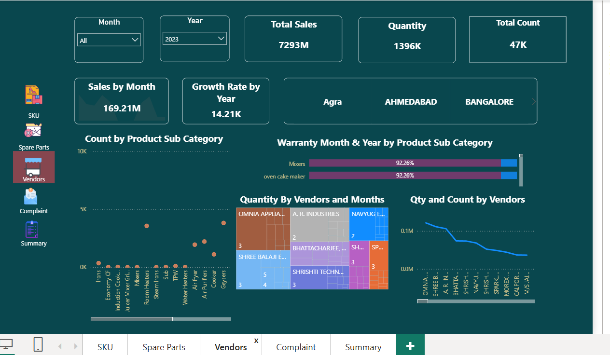
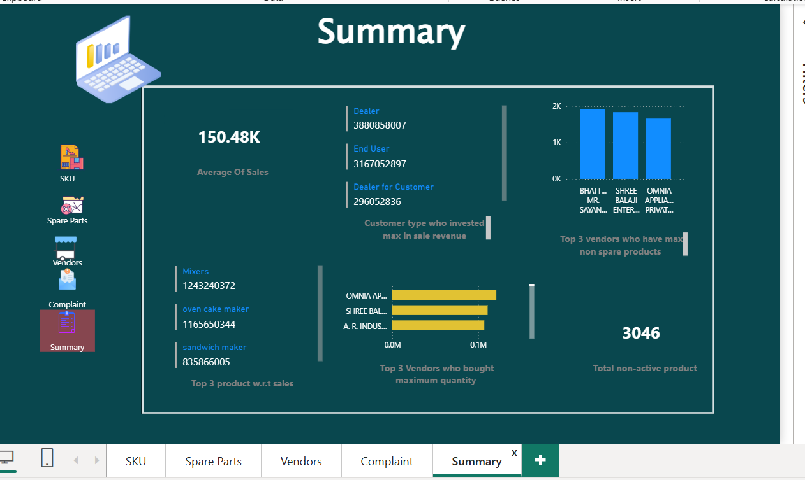

<!-- Paste this entire block into README.md in your repo -->
<h1 align="center">EZ Data Munch – Sales, Spare Parts & Vendor Analytics (SQL + Power BI Project)</h1>

  <strong>SQL analysis + Power BI dashboards</strong> 
  Transactional, warranty & complaint analytics for EZ Data Munch

<h2>About the Project</h2>

  This project analyses the <strong>EZ Data Munch</strong> sales dataset with SQL and visualizes insights using Power BI dashboards.
  The focus is on sales performance, SKU-level activity, spare-parts/defect trends, vendor contributions, warranty & complaint analysis and customer segmentation.

<h2>Table of Contents</h2>
<ul>
  <li><a href="#dataset-overview">Dataset Overview</a></li>
  <li><a href="#project-goals">Project Goals</a></li>
  <li><a href="#power-bi-dashboards-created">Power BI Dashboards</a></li>
  <li><a href="#sql-analysis-performed">SQL Analysis Performed</a></li>
  <li><a href="#power-bi-dax-measures">Power BI DAX Measures</a></li>
  <li><a href="#folder-structure">Recommended Folder Structure</a></li>
   <li><a href="#key-insights">Key Insights & Questions Answered</li>
  <li><a href="#conclusion">Conclusion</a></li>
</ul>

<h2 id="dataset-overview">Dataset Overview (EZ Data Munch)</h2>

The dataset contains transactional sale records, customer details, warranty details, complaint counts, vendor information and product subcategories used across the dashboards provided.

<table>
  <thead>
    <tr>
      <th>Column</th>
      <th>Description</th>
    </tr>
  </thead>
  <tbody>
    <tr><td>SKU</td><td>Product SKU identifier</td></tr>
    <tr><td>Product Subcategory</td><td>Product type / category</td></tr>
    <tr><td>City</td><td>City / branch</td></tr>
    <tr><td>Month, Year</td><td>Time dimensions</td></tr>
    <tr><td>Quantity</td><td>Units sold</td></tr>
    <tr><td>Total Sales</td><td>Sales value</td></tr>
    <tr><td>Customer Type</td><td>Dealer / Dealer for Customer / End User</td></tr>
    <tr><td>Warranty Months</td><td>Warranty period in months</td></tr>
    <tr><td>No. of Days to Complaint</td><td>Days until customer complaint</td></tr>
    <tr><td>SKU Status</td><td>Active / Phased Out</td></tr>
    <tr><td>Vendor Name</td><td>Supplier / vendor</td></tr>
    <tr><td>Complaint Code</td><td>Complaint identifier</td></tr>
  </tbody>
</table>

<h2 id="project-goals">Project Goals</h2>
<ul>
  <li>Identify high-performing SKUs and product subcategories</li>
  <li>Measure month-wise and city-wise sales</li>
  <li>Track active vs phased-out products</li>
  <li>Analyze customer-type behavior and complaints</li>
  <li>Measure vendor-wise product supply and trends</li>
  <li>Analyze warranty vs complaint relationships and defects</li>
</ul>

<h2 id="power-bi-dashboards-created">Power BI Dashboards Created</h2>

Below are the dashboards created from the EZ Data Munch dataset. Images shown are placeholders — replace the <code>src</code> paths with your actual file names in <code>/assets/</code> or update them accordingly.

<h3>1) SKU Dashboard</h3>

<strong>Key KPIs:</strong> Total Sales: <strong>7293M</strong> • Dealer Count: <strong>24K</strong> • End User Count: <strong>21K</strong> • Sales by Month: <strong>169.21M</strong> • Growth Rate (YoY): <strong>14.21K</strong>

<strong>Visuals:</strong> Sales by month trend, city filter, active vs phased-out SKU status, customer type by SKU, warranty vs complaint days.

<h3>2) Spare Parts Dashboard</h3>

<strong>Key KPIs:</strong> Total Sales: <strong>7293M</strong> • Product Calls: <strong>23K</strong> • Non-Spare Calls: <strong>24K</strong>

<strong>Visuals:</strong> Product calls by subcategory, non-spare calls by subcategory, primary defect counts, tertiary-defect pie charts.

<h3>3) Vendors Dashboard</h3>

<strong>Key KPIs:</strong> Total Sales: <strong>7293M</strong> • Quantity: <strong>1396K</strong> • Total Count: <strong>47K</strong>

<strong>Visuals:</strong> Product subcategory counts, warranty month/year by subcategory, quantity by vendor & month (treemap), vendor trends.

<h3>4) Complaint Dashboard <small>(screenshot pending)</small></h3>

<strong>Visuals expected:</strong> Complaint counts by product, imported vs India complaints, complaint days distribution, customer-type complaints, warranty vs complaint submission trend.

<h3>5) Summary Dashboard <small>(screenshot pending)</small></h3>

Overall project summary: top KPIs, aggregated trends, top products/vendors/customers, and high-level alerts.

<h2 id="sql-analysis-performed">SQL Analysis Performed</h2>

Major SQL tasks performed (examples):

<ul>
  <li>Data ingestion: load dataset into SQL tables</li>
  <li>Data cleaning: remove nulls, standardize category names, ensure numeric types</li>
  <li>Feature engineering: extract Month, Year, compute complaint age, categorize SKU status</li>
  <li>Business queries: total sales by city/month/year, SKU & product subcategory performance, vendor contributions, spare-parts & complaint analysis</li>
</ul>

<h2 id="power-bi-dax-measures">Power BI DAX Measures</h2>

Exact DAX measures used in the Power BI dashboards (copy-paste into your PBIX measure fields):

<strong>Complaint From Imported</strong>

<pre><code class="language-dax">Complaint From Imported =
CALCULATE(
    COUNT('QA -DATA FOR EZINSIGHTS (1)'[COMPLAINTCODE]),
    'QA -DATA FOR EZINSIGHTS (1)'[SKU_SOURCE] = "Imported"
)</code></pre>

<strong>Complaint From India</strong>

<pre><code class="language-dax">Complaint From India =
CALCULATE(
    COUNT('QA -DATA FOR EZINSIGHTS (1)'[COMPLAINTCODE]),
    'QA -DATA FOR EZINSIGHTS (1)'[SKU_SOURCE] = "Indian"
)</code></pre>

<strong>Complaint Diff</strong>

<pre><code class="language-dax">Complaint Diff =
[Complaint From India] - [Complaint From Imported]</code></pre>

<strong>Dealer Count</strong>

<pre><code class="language-dax">Dealer Count =
CALCULATE(
    COUNT('QA -DATA FOR EZINSIGHTS (1)'[COMPLAINTCODE]),
    'QA -DATA FOR EZINSIGHTS (1)'[CUSTTYPE] = "Dealer"
)</code></pre>

<em>Alternative: use <code>DISTINCTCOUNT</code> on a dealer id column if you want unique dealers instead of complaint rows.</em>

<strong>Total Non Active Product</strong>

<pre><code class="language-dax">Total Non Active Product =
CALCULATE(
    COUNT('QA -DATA FOR EZINSIGHTS (1)'[SKU_STATUS]),
    'QA -DATA FOR EZINSIGHTS (1)'[SKU_STATUS] = "PHASED OUT"
)</code></pre>

<strong>SaleAverage</strong>

<pre><code class="language-dax">SaleAverage =
AVERAGE('QA -DATA FOR EZINSIGHTS (1)'[Total Sales])</code></pre>

<strong>Notes & tips:</strong>

<ul>
  <li>If <code>COMPLAINTCODE</code> can be blank and you need row counts independent of its blanks, prefer <code>COUNTROWS(FILTER(...))</code>.</li>
  <li>For unique counts, use <code>DISTINCTCOUNT</code>.</li>
  <li>To ignore slicers intentionally, wrap filters with <code>ALL()</code> inside <code>CALCULATE</code>.</li>
  <li>Make sure column names match exactly (watch trailing spaces).</li>
</ul>

<h2 id="folder-structure">Recommended Folder Structure</h2>
<pre><code>
/EZ-Data-Munch-Analytics
│── data/
│── sql/
│── powerbi/
│     ├── SKU_Dashboard.pbix
│     ├── SpareParts_Dashboard.pbix
│     ├── Vendors_Dashboard.pbix
│     ├── Complaint_Dashboard.pbix
│     ├── Summary_Dashboard.pbix
│── assets/
│     ├── sku_dashboard.png
│     ├── spareparts_dashboard.png
│     ├── vendors_dashboard.png
│     ├── complaint_dashboard.png
│     ├── summary_dashboard.png
│── README.md
</code></pre>

<h2 id="key-insights"> Key Insights & Questions Answered</h2>

With the  Power BI dashboards, the project can answer a wide range of business questions across Sales, SKU activity, Spare Parts, Vendors, Warranty, Defects and Complaints.  
Below is a complete list of the insights unfolded from this analytics solution.

<h3> 1. Sales & Performance Insights</h3>
<ul>
  <li><strong>Which month has the highest total sales?</strong></li>
  <li><strong>Which city (Agra, Ahmedabad, Bangalore) contributes the most?</strong></li>
  <li><strong>Which product subcategories drive the highest revenue?</strong></li>
  <li><strong>Year-over-year growth rate in sales</strong></li>
  <li><strong>Total sales distribution across different customer types</strong></li>
  <li><strong>Quantity sold trend across months</strong></li>
  <li><strong>Average sales amount (SaleAverage DAX)</strong></li>
</ul>

<h3> 2. Customer Insights</h3>
<ul>
  <li><strong>Which customer type makes the most purchases?</strong> (Dealer, Dealer for Customer, End User)</li>
  <li><strong>Top cities by customer type activity</strong></li>
  <li><strong>Customer type with highest complaint count</strong></li>
  <li><strong>Number of Dealer complaints</strong> (Dealer Count DAX)</li>
  <li><strong>Patterns of customer complaints by SKU</strong></li>
</ul>

<h3> 3. SKU & Product Insights</h3>
<ul>
  <li><strong>Top-performing SKUs</strong> based on total sales</li>
  <li><strong>Bottom-performing SKUs</strong> based on low sales</li>
  <li><strong>Active SKUs vs Phased Out SKUs</strong></li>
  <li><strong>Total number of non-active products</strong> (via DAX measure)</li>
  <li><strong>Warranty months distribution by product type</strong></li>
  <li><strong>Which products face the highest complaint rate?</strong></li>
  <li><strong>Which products have the longest complaint resolution time?</strong></li>
</ul>

<h3>📍 4. Spare Parts & Defect Insights</h3>
<ul>
  <li><strong>Top product subcategories receiving maximum spare-part calls</strong></li>
  <li><strong>Non-spare part calls trend across products</strong></li>
  <li><strong>Primary, secondary and tertiary defect breakdown</strong></li>
  <li><strong>Recurring product issues by product type</strong></li>
  <li><strong>Products most prone to physical or warranty-related defects</strong></li>
  <li><strong>Complaint days analysis (time taken before customer complains)</strong></li>
</ul>

<h3> 5. Vendor Performance Insights</h3>
<ul>
  <li><strong>Which vendors supply the highest product quantity?</strong></li>
  <li><strong>Vendor-wise month-to-month supply trends</strong></li>
  <li><strong>Which vendors show a fall or rise in supply volume?</strong></li>
  <li><strong>Vendor contribution heatmap (quantity by vendor & month)</strong></li>
  <li><strong>Vendors with top complaint counts or product issues</strong></li>
</ul>

<h3> 6. Warranty & Complaint Insights</h3>
<ul>
  <li><strong>Total complaints from Indian products vs Imported products</strong> (Complaint Diff DAX)</li>
  <li><strong>Which category has more warranty-related problems?</strong></li>
  <li><strong>Warranty months vs complaint occurrence correlation</strong></li>
  <li><strong>Which product subcategories see complaint spikes after warranty expiry?</strong></li>
  <li><strong>Which customer segments generate the most warranty complaints?</strong></li>
</ul>

<h3> 7. Summary-Level Insights</h3>
<ul>
  <li><strong>Overall business performance across SKUs, vendors, and customers</strong></li>
  <li><strong>Total sales, total count, total complaints, and their year-wise trends</strong></li>
  <li><strong>Top 5 product subcategories driving business</strong></li>
  <li><strong>Top cities performing across all metrics</strong></li>
  <li><strong>End-to-end overview of operational and commercial health of EZ Data Munch</strong></li>
</ul>

<h3> What This Means for Stakeholders</h3>
<ul>
  <li><strong>Management</strong> can quickly identify business growth areas and risk zones.</li>
  <li><strong>Operations teams</strong> can track where product complaints are rising.</li>
  <li><strong>Warranty teams</strong> can understand complaint patterns vs warranty duration.</li>
  <li><strong>Sales teams</strong> can identify top-performing cities and products.</li>
  <li><strong>Vendor management</strong> can evaluate which suppliers are reliable.</li>
</ul>

<strong>In short, this project gives a 360° data-driven view of Sales, Products, Vendors, Customers, and Warranty operations.</strong>

<h2 id="conclusion">Conclusion</h2>

  The EZ Data Munch project with Power BI dashboards to produce actionable insights on product performance, spare parts & complaint behavior, vendor supply patterns, warranty-impact and customer segmentation.
  These outputs enable operations, sales and warranty teams to make data-driven decisions.

— End of README —

